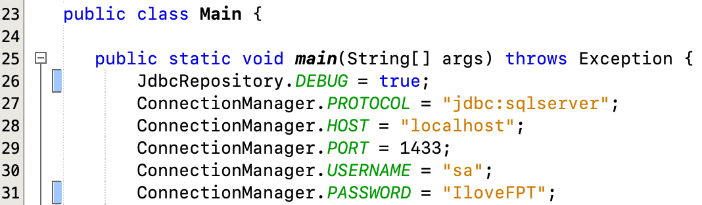

# BangMapleJDBCRepository
- Inspired by the JpaRepository of Spring framework which also provides many capabilities
for the CRUD, Pagination and Sorting operations.
- Maximizing the performance by using the native JDBC API with built-in Thread-safe Singleton pattern
for your Data Access Objects (DAO).
- Annotate your DTO with @Table, @Id, @Column to map your DTO to the table (Inspired by the ORM).
- Friendly-to-use syntax to retrieving your DAO by classpath or class type (Inspired by the Store of the NgRX library for Angular framework):
  `Store.select(UsersDAO.class)` to get UsersDAO instance.
  `Store.select("com.bangmaple.dao.UsersDAO")` to also get the UsersDAO instance.
---------------
## 🛠 Features:

- CRUD Operations.
- Paging operations.
- Sorting operations.

## 🕹 Current situation:

- Support for Microsoft SQL Server (MSSQL).

## 🔌 To do:

- Add support for MySQL and PostgreSQL.

## ❓ How to use:
- Create a new project then add this library by download the jar file from the `Release` tab.
- Or you can clone this repository without having download the jar file.
- `Remember to also add the JDBC driver`.
- For Servlet environment, you can configure like this by creating a 
new class `ServletListener` or the class implementing the `ServletContextListener` interface :


- For non-Servlet environment, navigate to your Main class and configure like this:



## ❗️ Appendix:
- If you want to show the SQL Query while executing the methods, there is
a `JdbcRepository.DEBUG` variable needed to be set as `true`. Default is `false`.
- You may notice there is a `ConnectionManager` class.
    + This class responsible for getting the `Connection` instance.
    + If you use Data Source way, there is a file `context.xml` in the `META-INF` folder.
    + If you chose the way to create a new `context.xml` file, please 
  set the name of the data source by `JDBCRepository` or the `ConnectionManager` won't initialize your connection pool.

| Class  | Variable | Description | 
| ------------- | ------------- | ------------ |
| JdbcRepository  | DEBUG (boolean)  | Responsible for logging SQL queries while running the application.|
| ConnectionManager  | PROTOCOL (String)  | The protocol for connecting to the database vendor. For MSSQL: `jdbc:sqlserver` |
| ConnectionManager | HOST (String) | The host of the SQL server. Example: `localhost` |
| ConnectionManager | PORT (Integer) | The port number of the SQL server. Example: `1433` | 
| ConnectionManager | USERNAME (String) | The username for logging in to the SQL server. Example: `sa` |
| ConnectionManager | PASSWORD (String) | The password for logging in to the SQL server. Example: `IloveFPT` |

- In order to use the JDBC Repository, you will need DTO and DAO. Let we configure these:


| Annotation  | Can be applied on | Description |
| ------------- | ------------- | ------------ |
| `Table`  | Class  | Make a class become an object for communicating with the database corresponding with the current mapping table. `name` for specifying the current mapping table, `catalog` for specifying the current mapping database name.|
| `Id`  | Field  | Mark a field as primary key column. Each DTO class must have at least 1 `Id` annotation applied only for only one field. |
| `Column` | Field | Mark a field to be mapped with the corresponding table's column. Use `value` to specify the value.|

- Now for the DAO class, create a normal class with a private constructor to respect the Singleton pattern.


- You may notice our DAO class extends the `Store` class which will responsible for storing the 
DAO classes only one instance each class by the Thread-safe Singleton pattern.
  + Why you named the class is `Store`:
    + Inspired by the NgRx (@ngrx/store) library for the Angular framework.
  + What is Singleton pattern? 
    + It is a pattern to allow class to have only one and one instance during the application's lifecycle.
    + Preventing initializing many instances of a class to prevent memory leaks.
  + Why Thread-safe Singleton pattern?
      + I believe that in a Multithreading environment like `Servlet`, threads will modify/use the instance safely for CRUD operations by applying this pattern.
- There is one thing that extends the `Store` class requires two generic types `T` and `ID`:
    + `T` stands for the matching DTO class. For example the `UsersDTO` class.
    + `ID` stands for the matching Id of the DTO class (table) type. For example, my annotated `Id` field is `String` type.
    + The result would be `Store<UsersDTO, String>` instead of `Store<T, ID>`.
For that, we have implemented our CRUD, Pagination, Sorting operations for our application.

To retrieve the `UsersDAO` instance, we have to select the instance:


This is similar to the usual way that we do:
```java 
UsersDAO dao = new UsersDAO();
```
Please don't initialize the `UsersDAO` instance by using the `new` keyword, this is against the `Singleton pattern`.
Luckily, we have the implemented `private constructor` to prevent that thing to be happening.

Now we have all the methods we need, I will list them all by the below table:

| Method  | Argument(s) | Returns | Description | 
| ------------- | ------------- | ------------ | ------------ |
| count()  | void  | int | Returns the number of entities available.|
| deleteAll()  | void | void | Delete all the entities. |
| deleteAllByIds(Iterable<? extends ID>) | List of ids | void | Deletes all instances of entities with the given IDs. |
| deleteById(ID) | The id of the entity | void | Deletes the entity with the given id. | 
| existsById(ID) | The id of the entity | boolean | Returns whether an entity with the given id exists. |
| findAll() | void | Iterable<T> | Returns all instances of the type. |
| findAll(Pageable) | Pageable object will be described below | Iterable<T> | Returns entities meeting the paging restriction provided in the `Pageable` object. |
| findAll(boolean) | boolean will be described below | Iterable<T> | Returns all entities sorted by the given option. |
| findAllByIds(Iterable<? extends ID>) | Iterable<T> | void | Returns all instances of the type {@code T} with the given IDs. |
| findById(ID) | The id of the entity | T | Retrieves an entity by its id. |
| insert(T) | The entity to be inserted | void | Insert the entity to the table as a record. |
| insertAll(Iterable<T>) | The list of entities to be inserted | void | Insert the entities to the table as records. |
| update(T, ID) | The entity to be updated, the id corresponding to the entity to be updated. | void | Update the specified entity with the corresponding id. |
| updateAll(Iterable<T>, Iterable<? extends ID> | The list entities to be updated, the list of ids corresponding to the the list of entities to be updated. | void | Update the specified entities with the corresponding ids.  |

- We found that there are two operations `findAll(Pageable)` and `findAll(boolean)`.
  + For the `Pageable` there are many way to use this operation:
  

  
  + Respects to the `PageRequest` object, we used the `of` method. For the example, we want to retrieve `5` records by the `first` page then we use `PageRequest.of(0, 5);`.
  

  
  + Now we passed the third parameter - `Pageable.SORT_DESC` this will be described as we want to retrieve `5` records 
by the `first` page in the `descending` order then we used `PageRequest.of(0, 5, Pageable.SORT_DESC)`. 
  

  + By default `Pagination` operation, the records are ordered by the primary key column (property that is annotated with `@Id`).
  + Now that we passed the final parameter - `String...`. For example, we want to retrieve `5` records
    by the `first` page in the `descending` order based on `fullname` and `role` then we used `PageRequest.of(0, 5, Pageable.SORT_DESC, "fullname", "role")`.

Let say we want to retrieve a list of users by their role name, but we didn't find any method related to that requirement.
We can customize to add our method by the following code snippet:
```java
import bangmaple.jdbc.utils.ConnectionManager;
import bangmaple.jdbc.dao.base.Store;

public class UsersDAO extends Store<UsersDTO, String> {
    
    private UsersDAO() {}
    
    public List<UsersDTO> findUsersByRole(String role) throws SQLException {
        List<UsersDTO> list = null;
        conn = ConnectionManager.getConnection();
        try {
            if (conn != null) {
                conn.setCatalog("users_management");
                String query = "SELECT username, password, fullname, role FROM users WHERE role = ?";
                prStm = conn.prepareStatement(query);
                prStm.setString(1, role);
                rs = prStm.executeQuery();
                list = new ArrayList<>();
                while (rs.next()) {
                    list.add(this.parseResultSetToDTO(rs, UsersDTO.class));
                }
            }
        } finally { closeConnection(); }
        return list;
    }
}
```

Now we implemented the `findUsersByRole(String)` to retrieve the users by their role name.
We may notice there are many variables we don't know, they are described as below:
- `conn` is `javax.sql.Connection` 
- `prStm` is `javax.sql.PreparedStatement`
- `rs` is `javax.sql.ResultSet`
- `ConnectionManager.getConnection()` retrieves the connection instance between our application and the database.
- `closeConnection()` closes the connection between our application and the database.
- `conn.setCatalog("users_management")` this is how we specify the database name. For example: `users_management`, please change to your database name.
- `this.parseResultSetToDTO(ResultSet, UsersDTO.class)` this method helps us to map the ResultSet's records after the 
`executeQuery()` operation to the `UsersDTO.class` then it will return the UsersDTO instance containing the information we need,
 this helper instance method is inherited from `Store` class.

----
- For the complete example of the CRUD operations, please navigate to <a href="https://github.com/bangmaple/BangMapleJDBCRepository/blob/master/src/bangmaple/Main.java">this</a> page.
- For the example of Data Source configuration as `context.xml`, please navigate to <a href="https://github.com/bangmaple/BangMapleJDBCRepository/blob/master/src/META-INF/context.xml">this</a> page.
----
### Thank your using this library. I made this library for more than 72 hours.
### Please don't hesitate to report bug(s) if you found, thanks again in advance!

----------------
### 💌 Credits

- <a href="https://fb.com/bangmaple">BangMaple</a>